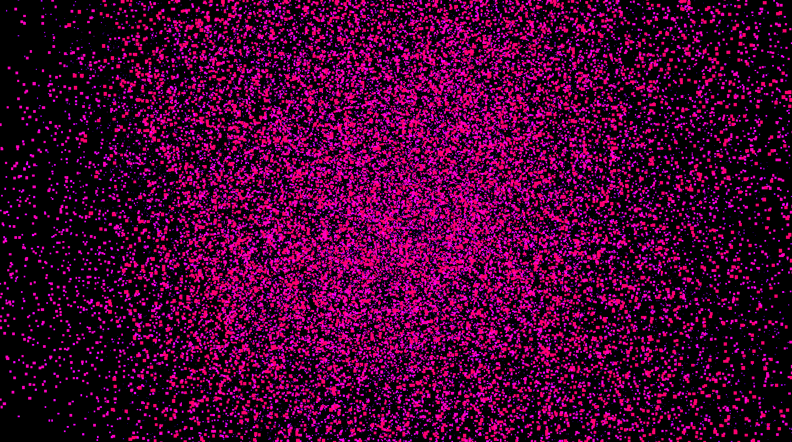

# RainbowCloudVR
An artistic VR experience that takes one inside of a point cloud with dynamic hue. 
</img>
### Requirements
WebVR compatable web browser (e.g., Mozilla Nightly) 
Stats.js 
Detector.js 
VRController.js 
### References
https://github.com/mrdoob/stats.js/ 
https://gist.github.com/minwe/a7ef59b808aa6c01f996 
https://github.com/stewdio/THREE.VRController 
https://threejs.org/ 
